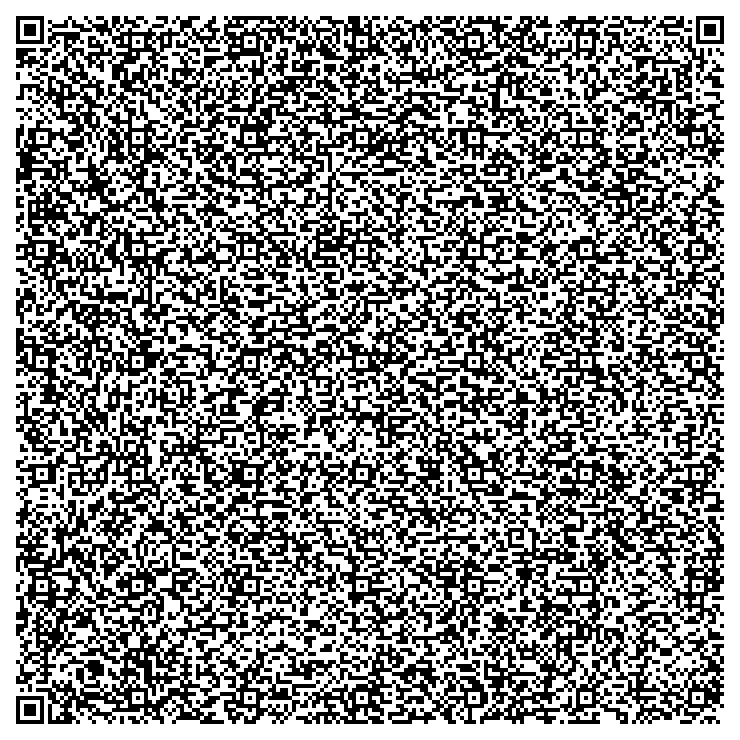

# QR code game

This repo contains a project I did in an evening just for fun.
The whole point was to try and fit a whole minigame in a QR code. Also it was using the `data` url, so as long as browsers with this directive exist, it should work.

The downsides of this approach are very apparent tho - only 2kb of size don't really leave much room for assets or code. But it was still fun to do stuff in such a constrained environment, and I guess there is a way of making more complex via eval function of js and splitting code into multiple qr codes, but I'll leave it as an exercise for the reader.